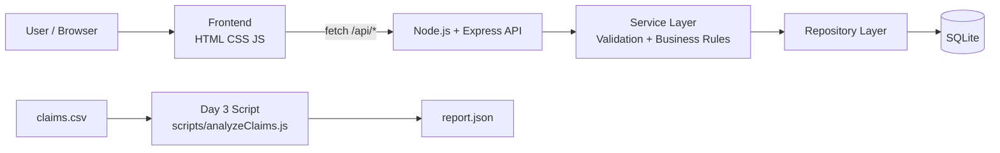

# agula-dev-task-emp1

3 хоногийн туршилтын даалгаврын хүрээнд хийсэн хялбаршуулсан даатгалын гэрээний систем.  
Backend нь REST API-гаар customer/policy удирдаж, frontend нь бүртгэл, жагсаалт, premium preview, cancel үйлдлүүдийг харуулна.  
`claims.csv` өгөгдөлд дүн шинжилгээ хийж `report.json` тайлан гаргадаг script нэмсэн.

## Хурдан ажиллуулах заавар

```bash
npm install
npm start
```

Browser:

```text
http://127.0.0.1:5050
```

## Архитектур



## Ашигласан технологи

- Node.js (CommonJS)
- Express
- SQLite (`sqlite3`)
- Vanilla HTML/CSS/JavaScript
- CSV Parser (`csv-parser`)

## Төслийн бүтэц

```text
backend/
  src/
    controllers/
    services/
    repositories/
    routes/
    utils/
    config/
    middlewares/
    app.js
    server.js
  database/
    schema.sql
    insurance.db
frontend/
  index.html
  customers.html
  policies.html
  css/style.css
  js/
    api.js
    customers.js
    policies.js
scripts/
  analyzeClaims.js
claims.csv
report.json
REFLECTION.md
```

## Суулгах ба ажиллуулах

1. Repository clone хийх
2. Root дээр dependencies суулгах
3. Server асаах
4. Browser-оор frontend нээх

```bash
git clone <repo-url>
cd agula-dev-task-emp1
npm install
npm start
```

Server default:

- Host: `127.0.0.1`
- Port: `5050`

Хэрэв `5050` порт завгүй бол:

```bash
PORT=5051 npm start
```

## API Endpoint-ууд

Base URL: `http://127.0.0.1:5050/api`

### Customer

- `POST /customers` - Шинэ даатгуулагч бүртгэх
- `GET /customers` - Бүх даатгуулагч
- `GET /customers/:id` - Нэг даатгуулагч + тухайн хүний гэрээнүүд

### Policy

- `POST /policies` - Шинэ гэрээ үүсгэх
- `GET /policies` - Бүх гэрээ (`?customer_id=`, `?status=` filter-тэй)
- `GET /policies/:id` - Нэг гэрээ
- `PATCH /policies/:id/cancel` - Идэвхтэй гэрээг цуцлах

## API request/response жишээ

### 1) Customer бүртгэх

Request:

```http
POST /api/customers
Content-Type: application/json
```

```json
{
  "first_name": "Bat",
  "last_name": "Bold",
  "register_number": "AB12345678",
  "birth_date": "1998-05-21",
  "phone": "99112233"
}
```

Response (`201`):

```json
{
  "success": true,
  "data": {
    "id": 1,
    "first_name": "Bat",
    "last_name": "Bold",
    "register_number": "AB12345678",
    "birth_date": "1998-05-21",
    "phone": "99112233"
  }
}
```

### 2) Policy үүсгэх (premium auto)

Request:

```http
POST /api/policies
Content-Type: application/json
```

```json
{
  "customer_id": 1,
  "policy_type": "car",
  "base_amount": 10000000,
  "start_date": "2026-01-01",
  "end_date": "2026-12-31"
}
```

Response (`201`):

```json
{
  "success": true,
  "data": {
    "id": 2,
    "customer_id": 1,
    "policy_type": "car",
    "base_amount": 10000000,
    "start_date": "2026-01-01",
    "end_date": "2026-12-31",
    "premium": 240000,
    "status": "active"
  }
}
```

### 3) Policy цуцлах

Request:

```http
PATCH /api/policies/2/cancel
```

Response (`200`):

```json
{
  "success": true,
  "message": "Policy cancelled successfully",
  "data": {
    "id": 2,
    "status": "cancelled"
  }
}
```

## Premium тооцоолол

```text
base_premium = base_amount * 0.02

age factor:
  age < 25   -> 1.5
  25-50      -> 1.0
  age > 50   -> 1.3

type factor:
  car    -> 1.2
  home   -> 1.0
  travel -> 0.8

premium = base_premium * age_factor * type_factor
```

## Frontend боломжууд

- Даатгуулагч бүртгэх form + frontend validation
- Даатгуулагчдын жагсаалт
- Нэг даатгуулагч дээр дарж дэлгэрэнгүй болон гэрээнүүдийг харах
- Шинэ policy үүсгэх form
- Premium real-time preview
- Active policy cancel хийх
- Loading/Error/Success state харуулах

## Day 3: Claims шинжилгээ

### Script ажиллуулах

```bash
npm run analyze
```

### Script output

- `report.json` файл үүсгэнэ
- Terminal дээр summary хэвлэнэ

### Энэ репо дээрх бодит үр дүн (claims.csv)

- Нийт нэхэмжлэл: `500`
- Approved: `280` (`56%`)
- Policy type дундаж claim amount:
  - `car`: `3793729.53`
  - `travel`: `1487398.53`
  - `home`: `7998853.30`
- Хамгийн их нэхэмжлэлтэй 3 сар:
  - `2024-04` (`30`)
  - `2025-04` (`28`)
  - `2025-09` (`27`)

Loss ratio-ийн тухай:

- `claims.csv` дотор шууд `policy_amount` багана байхгүй тул энэ төсөлд
  `loss_ratio_proxy = approved_claim_amount / total_claim_amount` гэж тооцсон.

## Техникийн сонголтын үндэслэл

- **Express + Node.js**: хурдан CRUD API босгоход энгийн, ойлгомжтой.
- **SQLite**: local environment дээр setup багатай, жижиг даалгаварт тохиромжтой.
- **Vanilla JS Frontend**: framework ашиглахгүйгээр logic-оо тодорхой харуулахад дөхөм.
- **Layered backend (controller/service/repository)**: logic-оо салгаж уншихад амар болгосон.

## Тулгарсан бэрхшээл ба шийдэл

- Business logic (premium тооцоолол + validation rule) нэг дор зөв урсгалтай бичихэд эхэндээ төвөгтэй байсан.
  Requirement-ийг хэсэгчилж (нас, төрөл, дүн, огноо) service layer дээр тусад нь шалгаж, дараа нь нэгтгэж шийдсэн.
- `policyRepository` файл буруу entity query ашиглаж байсан.
  Policies table query-үүдийг бүрэн засч, `findByCustomerId`, `updateStatus`-ийг ажиллуулсан.
- Frontend CORS болон `file://` origin асуудал гарсан.
  Frontend-ийг backend-с static serve хийж, API base-ийг same-origin байдлаар шийдсэн.
- `claims.csv` дээр policy amount дутуу байсан.
  README болон report-д proxy loss ratio гэсэн тайлбартайгаар шийдсэн.
